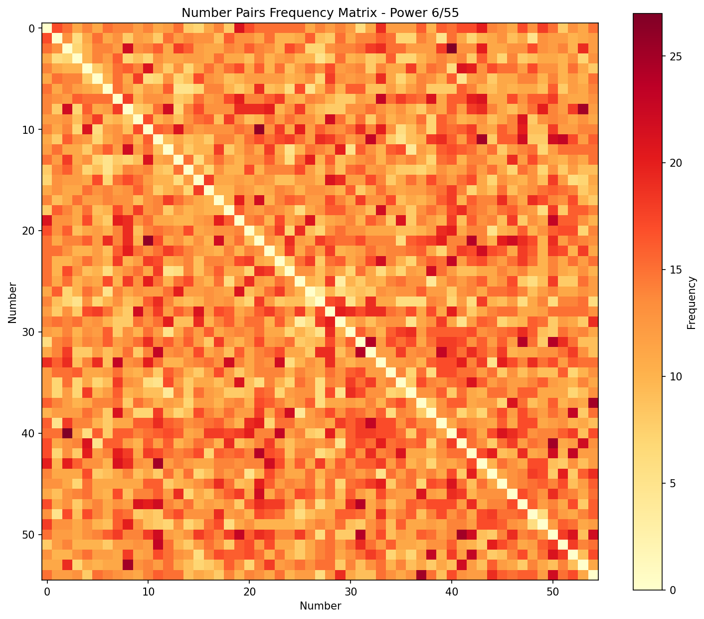

# 🎰 Vietlott Data

[](https://github.com/haah82/vietlott-data-update/actions)
[](https://www.python.org/downloads/)
[](LICENSE)
[](https://github.com/haah82/vietlott-data-update/commits/main)
[](https://haah82.github.io/vietlott-data-update/)

> 📊 **Thu thập và Tổng hợp Dữ liệu Vietlott Tự động nhằm mục đích học tập và giải trí**
>
> Dự án tự động thu thập và phân tích dữ liệu kết quả xổ số từ [vietlott.vn](https://vietlott.vn/), cung cấp thống kê chi tiết cho tất cả các sản phẩm.

## 🎯 Supported Lottery Products

| Product | Link | Description |
|---------|------|-------------|
| **Power 6/55** | [🔗 Results](https://vietlott.vn/vi/trung-thuong/ket-qua-trung-thuong/655.html) | Choose 6 numbers from 1-55 |
| **Power 6/45** | [🔗 Results](https://vietlott.vn/vi/trung-thuong/ket-qua-trung-thuong/645.html) | Choose 6 numbers from 1-45 |
| **Power 5/35** | [🔗 Results](https://vietlott.vn/vi/trung-thuong/ket-qua-trung-thuong/535.html) | Choose 5 numbers from 1-35 |
| **Keno** | [🔗 Results](https://vietlott.vn/vi/trung-thuong/ket-qua-trung-thuong/winning-number-keno.html) | Fast-pace number game |
| **Max 3D** | [🔗 Results](https://vietlott.vn/vi/trung-thuong/ket-qua-trung-thuong/max-3d.html) | 3-digit lottery game |
| **Max 3D Pro** | [🔗 Results](https://vietlott.vn/vi/trung-thuong/ket-qua-trung-thuong/max-3dpro.html) | Enhanced 3D lottery |
| **Bingo18** | [🔗 Results](https://vietlott.vn/vi/trung-thuong/ket-qua-trung-thuong/winning-number-bingo18.html) | 3 numbers from 0-9 game |


## 📋 Table of Contents

- [🎯 Supported Lottery Products](#-supported-lottery-products)
- [📊 Data Statistics](#-data-statistics)
- [🏆 Top Probability Summary](#-top-probability-summary)
- [📈 Top Backtest Summary](#-top-backtest-summary-machine-learning)
- [Predictions](#-predictions)
- [📈 Power 6/55 Analysis](#-power-655-analysis)
  - [📅 Recent Results](#-recent-results)
  - [🎲 Number Frequency (All Time)](#-number-frequency-all-time)
  - [📊 Frequency Analysis by Period](#-frequency-analysis-by-period)
- [📈 Power 6/45 Analysis](#-power-645-analysis)
  - [📅 Recent Results 6/45](#-recent-results-last-10-draws-645)
  - [🎲 Number Frequency 6/45](#-number-frequency-all-time-645)
- [📈 Max 3D Analysis](#-max-3d-analysis)
- [📈 Max 3D Pro Analysis](#-max-3d-pro-analysis)
- [⚙️ How It Works](#️-how-it-works)
- [🚀 Installation & Usage](#-installation--usage)
- [📄 License](#-license)


## 📊 Data Statistics

| Product | Total Draws | Start Date | End Date | Total Records | First ID | Latest ID |
| --- | --- | --- | --- | --- | --- | --- |
| Power 655 | 1292 | 2017-08-01 | 2026-01-08 | 1292 | 00001 | 01292 |
| Power 645 | 1259 | 2017-10-25 | 2026-01-09 | 1259 | 00198 | 01456 |
| Power 535 | 161 | 2025-06-29 | 2026-01-09 | 320 | 00001 | 00389 |
| Keno | 411 | 2022-12-04 | 2026-01-09 | 52875 | #0110271 | #0266204 |
| 3D | 1023 | 2019-04-22 | 2026-01-09 | 1023 | 00001 | 01027 |
| 3D Pro | 669 | 2021-09-14 | 2026-01-08 | 669 | 00001 | 00673 |
| Bingo18 | 386 | 2024-12-03 | 2026-01-09 | 52836 | 0083123 | 0147068 |


### 📊 Visualized Analysis




## 🏆 Top Probability Summary

This table shows the top 10 most frequent results (highest weights) for each major product.

| Rank | Product | Number/Set | Probability (%) |
| --- | --- | --- | --- |
| 1 | Power 6/55 | 41 | 2.12 |
| 2 | Power 6/55 | 22 | 2.08 |
| 3 | Power 6/55 | 43 | 2.06 |
| 4 | Power 6/55 | 51 | 2.03 |
| 5 | Power 6/55 | 34 | 2.03 |
| 6 | Power 6/55 | 40 | 2.0 |
| 7 | Power 6/55 | 9 | 1.99 |
| 8 | Power 6/55 | 8 | 1.96 |
| 9 | Power 6/55 | 20 | 1.96 |
| 10 | Power 6/55 | 48 | 1.95 |
| 1 | Power 6/45 | 24 | 2.48 |
| 2 | Power 6/45 | 19 | 2.48 |
| 3 | Power 6/45 | 10 | 2.48 |
| 4 | Power 6/45 | 7 | 2.45 |
| 5 | Power 6/45 | 28 | 2.42 |
| 6 | Power 6/45 | 37 | 2.41 |
| 7 | Power 6/45 | 22 | 2.41 |
| 8 | Power 6/45 | 44 | 2.4 |
| 9 | Power 6/45 | 30 | 2.36 |
| 10 | Power 6/45 | 20 | 2.34 |
| 1 | Max 3D Plus | 380 | 0.18 |
| 2 | Max 3D Plus | 656 | 0.17 |
| 3 | Max 3D Plus | 734 | 0.17 |
| 4 | Max 3D Plus | 706 | 0.16 |
| 5 | Max 3D Plus | 056 | 0.16 |
| 6 | Max 3D Plus | 939 | 0.16 |
| 7 | Max 3D Plus | 094 | 0.16 |
| 8 | Max 3D Plus | 799 | 0.16 |
| 9 | Max 3D Plus | 720 | 0.16 |
| 10 | Max 3D Plus | 334 | 0.15 |
| 1 | Max 3D Pro | 159 | 0.18 |
| 2 | Max 3D Pro | 605 | 0.18 |
| 3 | Max 3D Pro | 769 | 0.18 |
| 4 | Max 3D Pro | 190 | 0.17 |
| 5 | Max 3D Pro | 746 | 0.17 |
| 6 | Max 3D Pro | 089 | 0.17 |
| 7 | Max 3D Pro | 809 | 0.16 |
| 8 | Max 3D Pro | 896 | 0.16 |
| 9 | Max 3D Pro | 008 | 0.16 |
| 10 | Max 3D Pro | 074 | 0.16 |


## 📈 Top Backtest Summary (Machine Learning)

This table shows the top 10 numbers most frequently predicted by our ML models (Frequency & Pattern) during recent backtests.

| Rank | Product | Number/Set | Probability (%) |
| --- | --- | --- | --- |
| 1 | Power 6/55 | 15 | 2.67 |
| 2 | Power 6/55 | 38 | 2.61 |
| 3 | Power 6/55 | 29 | 2.61 |
| 4 | Power 6/55 | 11 | 2.44 |
| 5 | Power 6/55 | 14 | 2.44 |
| 6 | Power 6/55 | 20 | 2.39 |
| 7 | Power 6/55 | 27 | 2.33 |
| 8 | Power 6/55 | 33 | 2.33 |
| 9 | Power 6/55 | 22 | 2.28 |
| 10 | Power 6/55 | 31 | 2.17 |
| 1 | Power 6/45 | 3 | 3.17 |
| 2 | Power 6/45 | 35 | 3.06 |
| 3 | Power 6/45 | 9 | 2.94 |
| 4 | Power 6/45 | 30 | 2.89 |
| 5 | Power 6/45 | 20 | 2.72 |
| 6 | Power 6/45 | 28 | 2.56 |
| 7 | Power 6/45 | 23 | 2.56 |
| 8 | Power 6/45 | 8 | 2.5 |
| 9 | Power 6/45 | 19 | 2.5 |
| 10 | Power 6/45 | 29 | 2.5 |
| 1 | Max 3D Plus | 219 | 0.56 |
| 2 | Max 3D Plus | 793 | 0.56 |
| 3 | Max 3D Plus | 548 | 0.56 |
| 4 | Max 3D Plus | 868 | 0.56 |
| 5 | Max 3D Plus | 740 | 0.56 |
| 6 | Max 3D Plus | 214 | 0.44 |
| 7 | Max 3D Plus | 606 | 0.44 |
| 8 | Max 3D Plus | 614 | 0.44 |
| 9 | Max 3D Plus | 468 | 0.44 |
| 10 | Max 3D Plus | 521 | 0.44 |
| 1 | Max 3D Pro | 017 | 0.56 |
| 2 | Max 3D Pro | 172 | 0.56 |
| 3 | Max 3D Pro | 494 | 0.44 |
| 4 | Max 3D Pro | 705 | 0.44 |
| 5 | Max 3D Pro | 305 | 0.44 |
| 6 | Max 3D Pro | 892 | 0.44 |
| 7 | Max 3D Pro | 449 | 0.44 |
| 8 | Max 3D Pro | 642 | 0.44 |
| 9 | Max 3D Pro | 142 | 0.44 |
| 10 | Max 3D Pro | 708 | 0.44 |


## Predictions

Models and predictions are updated daily at [/src/predictions](./src/machine_learning/prediction_summary.md)

## 📈 Power 6/55 Analysis

### 📅 Recent Results (Last 10 draws)
| date | id | result | process_time |
| --- | --- | --- | --- |
| 2026-01-08 | 01292 | [20, 22, 36, 43, 45, 50, 47] | 2026-01-09T18:53:58.591551 |
| 2026-01-06 | 01291 | [22, 28, 29, 30, 34, 47, 20] | 2026-01-09T18:53:58.591650 |
| 2026-01-03 | 01290 | [10, 16, 17, 23, 33, 36, 42] | 2026-01-09T18:53:58.591714 |
| 2026-01-01 | 01289 | [5, 16, 29, 33, 39, 42, 54] | 2026-01-09T18:53:58.591773 |
| 2025-12-30 | 01288 | [11, 30, 35, 41, 48, 55, 38] | 2026-01-09T18:53:58.591828 |
| 2025-12-27 | 01287 | [16, 21, 30, 37, 39, 40, 13] | 2026-01-09T18:53:58.591883 |
| 2025-12-25 | 01286 | [4, 6, 32, 37, 40, 48, 38] | 2026-01-09T18:53:58.591934 |
| 2025-12-23 | 01285 | [2, 10, 16, 25, 32, 38, 3] | 2026-01-09T18:53:58.591986 |
| 2025-12-20 | 01284 | [22, 32, 33, 35, 40, 41, 23] | 2025-12-21T00:00:50.783917 |
| 2025-12-18 | 01283 | [12, 14, 29, 30, 39, 55, 50] | 2025-12-19T00:00:54.542458 |

### 🎲 Number Frequency (All Time)
| result | count | % | -1 | 1result | 1count | 1% | -2 | 2result | 2count | 2% |
| --- | --- | --- | --- | --- | --- | --- | --- | --- | --- | --- |
| 41 | 192 | 2.12 |  | 32 | 169 | 1.87 |  | 36 | 156 | 1.73 |
| 22 | 188 | 2.08 |  | 52 | 168 | 1.86 |  | 10 | 156 | 1.73 |
| 43 | 186 | 2.06 |  | 46 | 168 | 1.86 |  | 54 | 154 | 1.7 |
| 51 | 184 | 2.03 |  | 24 | 167 | 1.85 |  | 15 | 153 | 1.69 |
| 34 | 184 | 2.03 |  | 33 | 167 | 1.85 |  | 27 | 152 | 1.68 |
| 40 | 181 | 2.0 |  | 18 | 166 | 1.84 |  | 37 | 150 | 1.66 |
| 9 | 180 | 1.99 |  | 19 | 166 | 1.84 |  | 26 | 150 | 1.66 |
| 8 | 177 | 1.96 |  | 5 | 166 | 1.84 |  | 30 | 149 | 1.65 |
| 20 | 177 | 1.96 |  | 45 | 165 | 1.82 |  | 17 | 149 | 1.65 |
| 48 | 176 | 1.95 |  | 14 | 165 | 1.82 |  | 2 | 149 | 1.65 |
| 23 | 176 | 1.95 |  | 47 | 165 | 1.82 |  | 28 | 144 | 1.59 |
| 3 | 175 | 1.94 |  | 49 | 164 | 1.81 |  | 25 | 144 | 1.59 |
| 29 | 175 | 1.94 |  | 50 | 164 | 1.81 |  | 7 | 141 | 1.56 |
| 1 | 173 | 1.91 |  | 55 | 163 | 1.8 |  | 6 | 139 | 1.54 |
| 31 | 173 | 1.91 |  | 35 | 162 | 1.79 |  | 4 | 136 | 1.5 |
| 12 | 172 | 1.9 |  | 38 | 159 | 1.76 |  |  |  |  |
| 42 | 170 | 1.88 |  | 21 | 158 | 1.75 |  |  |  |  |
| 11 | 170 | 1.88 |  | 13 | 157 | 1.74 |  |  |  |  |
| 44 | 170 | 1.88 |  | 16 | 157 | 1.74 |  |  |  |  |
| 53 | 170 | 1.88 |  | 39 | 156 | 1.73 |  |  |  |  |

### 📊 Frequency Analysis by Period

#### Last 30 Days
| result | count | % | -1 | 1result | 1count | 1% | -2 | 2result | 2count | 2% |
| --- | --- | --- | --- | --- | --- | --- | --- | --- | --- | --- |
| 16 | 4 | 5.19 |  | 42 | 2 | 2.6 |  | 12 | 1 | 1.3 |
| 38 | 4 | 5.19 |  | 3 | 1 | 1.3 |  |  |  |  |
| 30 | 4 | 5.19 |  | 25 | 1 | 1.3 |  |  |  |  |
| 33 | 3 | 3.9 |  | 54 | 1 | 1.3 |  |  |  |  |
| 29 | 3 | 3.9 |  | 13 | 1 | 1.3 |  |  |  |  |
| 40 | 3 | 3.9 |  | 2 | 1 | 1.3 |  |  |  |  |
| 22 | 3 | 3.9 |  | 11 | 1 | 1.3 |  |  |  |  |
| 55 | 3 | 3.9 |  | 28 | 1 | 1.3 |  |  |  |  |
| 37 | 3 | 3.9 |  | 7 | 1 | 1.3 |  |  |  |  |
| 39 | 3 | 3.9 |  | 4 | 1 | 1.3 |  |  |  |  |
| 36 | 3 | 3.9 |  | 14 | 1 | 1.3 |  |  |  |  |
| 32 | 3 | 3.9 |  | 43 | 1 | 1.3 |  |  |  |  |
| 35 | 2 | 2.6 |  | 17 | 1 | 1.3 |  |  |  |  |
| 20 | 2 | 2.6 |  | 46 | 1 | 1.3 |  |  |  |  |
| 10 | 2 | 2.6 |  | 52 | 1 | 1.3 |  |  |  |  |
| 41 | 2 | 2.6 |  | 6 | 1 | 1.3 |  |  |  |  |
| 47 | 2 | 2.6 |  | 45 | 1 | 1.3 |  |  |  |  |
| 50 | 2 | 2.6 |  | 5 | 1 | 1.3 |  |  |  |  |
| 48 | 2 | 2.6 |  | 34 | 1 | 1.3 |  |  |  |  |
| 23 | 2 | 2.6 |  | 21 | 1 | 1.3 |  |  |  |  |

#### Last 60 Days
| result | count | % | -1 | 1result | 1count | 1% | -2 | 2result | 2count | 2% |
| --- | --- | --- | --- | --- | --- | --- | --- | --- | --- | --- |
| 38 | 7 | 4.35 |  | 35 | 3 | 1.86 |  | 8 | 2 | 1.24 |
| 10 | 6 | 3.73 |  | 23 | 3 | 1.86 |  | 9 | 2 | 1.24 |
| 20 | 6 | 3.73 |  | 31 | 3 | 1.86 |  | 24 | 2 | 1.24 |
| 29 | 5 | 3.11 |  | 34 | 3 | 1.86 |  | 41 | 2 | 1.24 |
| 42 | 5 | 3.11 |  | 52 | 3 | 1.86 |  | 26 | 2 | 1.24 |
| 48 | 5 | 3.11 |  | 13 | 3 | 1.86 |  | 6 | 1 | 0.62 |
| 30 | 5 | 3.11 |  | 46 | 3 | 1.86 |  | 17 | 1 | 0.62 |
| 12 | 5 | 3.11 |  | 21 | 3 | 1.86 |  | 49 | 1 | 0.62 |
| 32 | 5 | 3.11 |  | 50 | 3 | 1.86 |  | 51 | 1 | 0.62 |
| 16 | 5 | 3.11 |  | 27 | 2 | 1.24 |  | 25 | 1 | 0.62 |
| 55 | 4 | 2.48 |  | 7 | 2 | 1.24 |  | 2 | 1 | 0.62 |
| 33 | 4 | 2.48 |  | 45 | 2 | 1.24 |  | 53 | 1 | 0.62 |
| 14 | 4 | 2.48 |  | 54 | 2 | 1.24 |  | 44 | 1 | 0.62 |
| 5 | 4 | 2.48 |  | 19 | 2 | 1.24 |  | 15 | 1 | 0.62 |
| 37 | 4 | 2.48 |  | 3 | 2 | 1.24 |  |  |  |  |
| 4 | 4 | 2.48 |  | 18 | 2 | 1.24 |  |  |  |  |
| 22 | 4 | 2.48 |  | 43 | 2 | 1.24 |  |  |  |  |
| 40 | 4 | 2.48 |  | 47 | 2 | 1.24 |  |  |  |  |
| 36 | 4 | 2.48 |  | 28 | 2 | 1.24 |  |  |  |  |
| 39 | 3 | 1.86 |  | 11 | 2 | 1.24 |  |  |  |  |

#### Last 90 Days
| result | count | % | -1 | 1result | 1count | 1% | -2 | 2result | 2count | 2% |
| --- | --- | --- | --- | --- | --- | --- | --- | --- | --- | --- |
| 38 | 10 | 3.97 |  | 54 | 5 | 1.98 |  | 7 | 3 | 1.19 |
| 20 | 9 | 3.57 |  | 37 | 5 | 1.98 |  | 6 | 3 | 1.19 |
| 10 | 8 | 3.17 |  | 27 | 5 | 1.98 |  | 15 | 3 | 1.19 |
| 29 | 8 | 3.17 |  | 8 | 5 | 1.98 |  | 24 | 3 | 1.19 |
| 16 | 8 | 3.17 |  | 43 | 5 | 1.98 |  | 18 | 3 | 1.19 |
| 30 | 7 | 2.78 |  | 41 | 5 | 1.98 |  | 46 | 3 | 1.19 |
| 22 | 7 | 2.78 |  | 13 | 5 | 1.98 |  | 52 | 3 | 1.19 |
| 40 | 7 | 2.78 |  | 50 | 5 | 1.98 |  | 25 | 2 | 0.79 |
| 33 | 7 | 2.78 |  | 55 | 5 | 1.98 |  | 26 | 2 | 0.79 |
| 48 | 6 | 2.38 |  | 47 | 4 | 1.59 |  | 2 | 2 | 0.79 |
| 11 | 6 | 2.38 |  | 19 | 4 | 1.59 |  | 44 | 2 | 0.79 |
| 36 | 6 | 2.38 |  | 45 | 4 | 1.59 |  | 1 | 1 | 0.4 |
| 42 | 6 | 2.38 |  | 28 | 4 | 1.59 |  | 51 | 1 | 0.4 |
| 14 | 6 | 2.38 |  | 3 | 4 | 1.59 |  | 53 | 1 | 0.4 |
| 31 | 6 | 2.38 |  | 23 | 4 | 1.59 |  | 17 | 1 | 0.4 |
| 5 | 6 | 2.38 |  | 4 | 4 | 1.59 |  |  |  |  |
| 12 | 6 | 2.38 |  | 49 | 3 | 1.19 |  |  |  |  |
| 35 | 5 | 1.98 |  | 39 | 3 | 1.19 |  |  |  |  |
| 32 | 5 | 1.98 |  | 34 | 3 | 1.19 |  |  |  |  |
| 21 | 5 | 1.98 |  | 9 | 3 | 1.19 |  |  |  |  |


## 📈 Power 6/45 Analysis

### 📅 Recent Results (Last 10 draws)
| date | id | result | process_time |
| --- | --- | --- | --- |
| 2026-01-09 | 01456 | [8, 9, 17, 21, 36, 45] | 2026-01-09T18:55:03.608163 |
| 2026-01-07 | 01455 | [1, 5, 7, 28, 31, 43] | 2026-01-09T18:55:03.608263 |
| 2026-01-04 | 01454 | [2, 12, 21, 29, 35, 44] | 2026-01-09T18:55:03.608339 |
| 2026-01-02 | 01453 | [7, 18, 22, 32, 37, 38] | 2026-01-09T18:55:03.608413 |
| 2025-12-31 | 01452 | [1, 25, 35, 36, 37, 45] | 2026-01-09T18:55:03.608480 |
| 2025-12-28 | 01451 | [1, 2, 7, 16, 31, 37] | 2026-01-09T18:55:03.608545 |
| 2025-12-26 | 01450 | [4, 6, 16, 25, 27, 40] | 2026-01-09T18:55:03.608607 |
| 2025-12-24 | 01449 | [15, 19, 31, 35, 43, 45] | 2026-01-09T18:55:03.608666 |
| 2025-12-21 | 01448 | [6, 9, 12, 18, 29, 43] | 2025-12-22T00:01:15.347990 |
| 2025-12-19 | 01447 | [1, 21, 36, 42, 43, 44] | 2025-12-20T00:01:12.378702 |

### 🎲 Number Frequency (All Time)
| result | count | % | -1 | 1result | 1count | 1% | -2 | 2result | 2count | 2% |
| --- | --- | --- | --- | --- | --- | --- | --- | --- | --- | --- |
| 24 | 187 | 2.48 |  | 13 | 168 | 2.22 |  | 2 | 154 | 2.04 |
| 19 | 187 | 2.48 |  | 1 | 168 | 2.22 |  | 12 | 152 | 2.01 |
| 10 | 187 | 2.48 |  | 31 | 168 | 2.22 |  | 32 | 152 | 2.01 |
| 7 | 185 | 2.45 |  | 26 | 168 | 2.22 |  | 38 | 146 | 1.93 |
| 28 | 183 | 2.42 |  | 43 | 167 | 2.21 |  | 17 | 145 | 1.92 |
| 37 | 182 | 2.41 |  | 25 | 167 | 2.21 |  |  |  |  |
| 22 | 182 | 2.41 |  | 23 | 167 | 2.21 |  |  |  |  |
| 44 | 181 | 2.4 |  | 6 | 165 | 2.18 |  |  |  |  |
| 30 | 178 | 2.36 |  | 16 | 165 | 2.18 |  |  |  |  |
| 20 | 177 | 2.34 |  | 8 | 165 | 2.18 |  |  |  |  |
| 4 | 176 | 2.33 |  | 33 | 164 | 2.17 |  |  |  |  |
| 41 | 175 | 2.32 |  | 42 | 164 | 2.17 |  |  |  |  |
| 34 | 174 | 2.3 |  | 14 | 163 | 2.16 |  |  |  |  |
| 29 | 174 | 2.3 |  | 9 | 159 | 2.1 |  |  |  |  |
| 27 | 173 | 2.29 |  | 39 | 158 | 2.09 |  |  |  |  |
| 11 | 172 | 2.28 |  | 36 | 157 | 2.08 |  |  |  |  |
| 18 | 171 | 2.26 |  | 40 | 157 | 2.08 |  |  |  |  |
| 35 | 170 | 2.25 |  | 3 | 155 | 2.05 |  |  |  |  |
| 45 | 169 | 2.24 |  | 15 | 154 | 2.04 |  |  |  |  |
| 5 | 169 | 2.24 |  | 21 | 154 | 2.04 |  |  |  |  |

### 📊 Frequency Analysis by Period

#### Last 30 Days
| result | count | % | -1 | 1result | 1count | 1% |
| --- | --- | --- | --- | --- | --- | --- |
| 43 | 5 | 7.58 |  | 22 | 1 | 1.52 |
| 1 | 4 | 6.06 |  | 19 | 1 | 1.52 |
| 21 | 3 | 4.55 |  | 41 | 1 | 1.52 |
| 7 | 3 | 4.55 |  | 32 | 1 | 1.52 |
| 37 | 3 | 4.55 |  | 15 | 1 | 1.52 |
| 45 | 3 | 4.55 |  | 24 | 1 | 1.52 |
| 31 | 3 | 4.55 |  | 40 | 1 | 1.52 |
| 35 | 3 | 4.55 |  | 27 | 1 | 1.52 |
| 36 | 3 | 4.55 |  | 14 | 1 | 1.52 |
| 2 | 2 | 3.03 |  | 17 | 1 | 1.52 |
| 44 | 2 | 3.03 |  | 28 | 1 | 1.52 |
| 38 | 2 | 3.03 |  | 8 | 1 | 1.52 |
| 25 | 2 | 3.03 |  | 42 | 1 | 1.52 |
| 29 | 2 | 3.03 |  | 4 | 1 | 1.52 |
| 9 | 2 | 3.03 |  |  |  |  |
| 18 | 2 | 3.03 |  |  |  |  |
| 5 | 2 | 3.03 |  |  |  |  |
| 16 | 2 | 3.03 |  |  |  |  |
| 6 | 2 | 3.03 |  |  |  |  |
| 12 | 2 | 3.03 |  |  |  |  |

#### Last 60 Days
| result | count | % | -1 | 1result | 1count | 1% | -2 | 2result | 2count | 2% |
| --- | --- | --- | --- | --- | --- | --- | --- | --- | --- | --- |
| 43 | 9 | 6.25 |  | 45 | 4 | 2.78 |  | 27 | 1 | 0.69 |
| 7 | 6 | 4.17 |  | 23 | 4 | 2.78 |  | 33 | 1 | 0.69 |
| 2 | 5 | 3.47 |  | 21 | 3 | 2.08 |  | 24 | 1 | 0.69 |
| 1 | 5 | 3.47 |  | 5 | 3 | 2.08 |  | 26 | 1 | 0.69 |
| 19 | 5 | 3.47 |  | 25 | 3 | 2.08 |  |  |  |  |
| 8 | 5 | 3.47 |  | 13 | 3 | 2.08 |  |  |  |  |
| 31 | 5 | 3.47 |  | 16 | 3 | 2.08 |  |  |  |  |
| 29 | 4 | 2.78 |  | 34 | 3 | 2.08 |  |  |  |  |
| 15 | 4 | 2.78 |  | 17 | 3 | 2.08 |  |  |  |  |
| 18 | 4 | 2.78 |  | 41 | 2 | 1.39 |  |  |  |  |
| 44 | 4 | 2.78 |  | 20 | 2 | 1.39 |  |  |  |  |
| 38 | 4 | 2.78 |  | 11 | 2 | 1.39 |  |  |  |  |
| 37 | 4 | 2.78 |  | 6 | 2 | 1.39 |  |  |  |  |
| 12 | 4 | 2.78 |  | 22 | 2 | 1.39 |  |  |  |  |
| 36 | 4 | 2.78 |  | 40 | 2 | 1.39 |  |  |  |  |
| 42 | 4 | 2.78 |  | 32 | 2 | 1.39 |  |  |  |  |
| 30 | 4 | 2.78 |  | 4 | 2 | 1.39 |  |  |  |  |
| 9 | 4 | 2.78 |  | 39 | 1 | 0.69 |  |  |  |  |
| 35 | 4 | 2.78 |  | 3 | 1 | 0.69 |  |  |  |  |
| 28 | 4 | 2.78 |  | 14 | 1 | 0.69 |  |  |  |  |

#### Last 90 Days
| result | count | % | -1 | 1result | 1count | 1% | -2 | 2result | 2count | 2% |
| --- | --- | --- | --- | --- | --- | --- | --- | --- | --- | --- |
| 43 | 12 | 5.41 |  | 3 | 5 | 2.25 |  | 6 | 2 | 0.9 |
| 42 | 9 | 4.05 |  | 8 | 5 | 2.25 |  | 10 | 2 | 0.9 |
| 31 | 9 | 4.05 |  | 17 | 5 | 2.25 |  | 22 | 2 | 0.9 |
| 30 | 8 | 3.6 |  | 45 | 5 | 2.25 |  | 14 | 1 | 0.45 |
| 7 | 8 | 3.6 |  | 34 | 5 | 2.25 |  | 33 | 1 | 0.45 |
| 18 | 7 | 3.15 |  | 35 | 5 | 2.25 |  |  |  |  |
| 44 | 7 | 3.15 |  | 16 | 5 | 2.25 |  |  |  |  |
| 37 | 7 | 3.15 |  | 11 | 4 | 1.8 |  |  |  |  |
| 28 | 7 | 3.15 |  | 26 | 4 | 1.8 |  |  |  |  |
| 2 | 7 | 3.15 |  | 41 | 4 | 1.8 |  |  |  |  |
| 15 | 6 | 2.7 |  | 24 | 4 | 1.8 |  |  |  |  |
| 12 | 6 | 2.7 |  | 13 | 4 | 1.8 |  |  |  |  |
| 38 | 5 | 2.25 |  | 20 | 4 | 1.8 |  |  |  |  |
| 23 | 5 | 2.25 |  | 5 | 4 | 1.8 |  |  |  |  |
| 19 | 5 | 2.25 |  | 21 | 3 | 1.35 |  |  |  |  |
| 25 | 5 | 2.25 |  | 40 | 3 | 1.35 |  |  |  |  |
| 36 | 5 | 2.25 |  | 27 | 3 | 1.35 |  |  |  |  |
| 1 | 5 | 2.25 |  | 4 | 3 | 1.35 |  |  |  |  |
| 9 | 5 | 2.25 |  | 32 | 3 | 1.35 |  |  |  |  |
| 29 | 5 | 2.25 |  | 39 | 3 | 1.35 |  |  |  |  |


## 📈 Max 3D Plus Analysis

### 📅 Recent Results (Last 10 draws)
| date | id | result |
| --- | --- | --- |
| 2026-01-09 | 01027 | 852, 190, 250, 008, 296, 153, 674, 284, 340, 893, 296, 152, 611, 783, 349, 765, 362, 106, 913, 540 |
| 2026-01-07 | 01026 | 454, 459, 691, 416, 897, 741, 868, 965, 785, 869, 872, 207, 269, 945, 606, 403, 071, 958, 476, 171 |
| 2026-01-05 | 01025 | 862, 671, 006, 651, 760, 747, 026, 320, 756, 277, 746, 194, 810, 507, 375, 583, 098, 952, 770, 690 |
| 2026-01-02 | 01024 | 344, 808, 454, 463, 611, 632, 948, 946, 203, 918, 124, 943, 156, 008, 534, 724, 223, 315, 603, 679 |
| 2025-12-31 | 01023 | 098, 906, 903, 722, 209, 638, 489, 366, 631, 431, 360, 574, 774, 622, 422, 769, 843, 815, 007, 599 |
| 2025-12-29 | 01022 | 401, 220, 534, 460, 914, 127, 063, 632, 607, 919, 036, 297, 690, 815, 639, 664, 158, 138, 554, 323 |
| 2025-12-26 | 01021 | 213, 603, 007, 876, 723, 238, 869, 958, 229, 522, 592, 208, 258, 162, 455, 955, 379, 127, 964, 713 |
| 2025-12-24 | 01020 | 386, 744, 752, 672, 688, 395, 885, 288, 255, 711, 224, 658, 541, 687, 941, 318, 005, 677, 879, 141 |
| 2025-12-22 | 01019 | 973, 492, 190, 025, 071, 024, 720, 676, 842, 756, 700, 482, 608, 880, 937, 216, 335, 176, 647, 130 |
| 2025-12-19 | 01018 | 947, 331, 038, 653, 371, 396, 206, 761, 048, 431, 334, 635, 878, 491, 578, 503, 300, 855, 429, 579 |

### 🎲 Top 3-Digit Number Frequency (All Time)
| result | count | % | -1 | 1result | 1count | 1% | -2 | 2result | 2count | 2% | -3 | 3result | 3count | 3% | -4 | 4result | 4count | 4% |
| --- | --- | --- | --- | --- | --- | --- | --- | --- | --- | --- | --- | --- | --- | --- | --- | --- | --- | --- |
| 380 | 36 | 0.18 |  | 099 | 30 | 0.15 |  | 222 | 28 | 0.14 |  | 895 | 28 | 0.14 |  | 437 | 27 | 0.13 |
| 656 | 35 | 0.17 |  | 450 | 30 | 0.15 |  | 156 | 28 | 0.14 |  | 005 | 28 | 0.14 |  | 441 | 27 | 0.13 |
| 734 | 34 | 0.17 |  | 411 | 30 | 0.15 |  | 329 | 28 | 0.14 |  | 528 | 28 | 0.14 |  | 046 | 27 | 0.13 |
| 706 | 33 | 0.16 |  | 553 | 30 | 0.15 |  | 846 | 28 | 0.14 |  | 037 | 28 | 0.14 |  | 043 | 27 | 0.13 |
| 799 | 32 | 0.16 |  | 331 | 29 | 0.14 |  | 189 | 28 | 0.14 |  | 466 | 27 | 0.13 |  | 694 | 27 | 0.13 |
| 094 | 32 | 0.16 |  | 163 | 29 | 0.14 |  | 881 | 28 | 0.14 |  | 933 | 27 | 0.13 |  | 966 | 27 | 0.13 |
| 056 | 32 | 0.16 |  | 878 | 29 | 0.14 |  | 255 | 28 | 0.14 |  | 372 | 27 | 0.13 |  | 215 | 27 | 0.13 |
| 939 | 32 | 0.16 |  | 489 | 29 | 0.14 |  | 766 | 28 | 0.14 |  | 060 | 27 | 0.13 |  | 843 | 27 | 0.13 |
| 720 | 32 | 0.16 |  | 691 | 29 | 0.14 |  | 284 | 28 | 0.14 |  | 719 | 27 | 0.13 |  | 486 | 27 | 0.13 |
| 217 | 31 | 0.15 |  | 750 | 29 | 0.14 |  | 661 | 28 | 0.14 |  | 058 | 27 | 0.13 |  | 510 | 27 | 0.13 |
| 350 | 31 | 0.15 |  | 048 | 28 | 0.14 |  | 866 | 28 | 0.14 |  | 176 | 27 | 0.13 |  | 550 | 27 | 0.13 |
| 769 | 31 | 0.15 |  | 377 | 28 | 0.14 |  | 625 | 28 | 0.14 |  | 780 | 27 | 0.13 |  | 865 | 27 | 0.13 |
| 006 | 31 | 0.15 |  | 834 | 28 | 0.14 |  | 425 | 28 | 0.14 |  | 607 | 27 | 0.13 |  | 970 | 27 | 0.13 |
| 786 | 31 | 0.15 |  | 400 | 28 | 0.14 |  | 321 | 28 | 0.14 |  | 125 | 27 | 0.13 |  | 223 | 27 | 0.13 |
| 289 | 31 | 0.15 |  | 790 | 28 | 0.14 |  | 546 | 28 | 0.14 |  | 240 | 27 | 0.13 |  | 805 | 27 | 0.13 |
| 459 | 31 | 0.15 |  | 086 | 28 | 0.14 |  | 085 | 28 | 0.14 |  | 807 | 27 | 0.13 |  | 721 | 27 | 0.13 |
| 334 | 31 | 0.15 |  | 525 | 28 | 0.14 |  | 646 | 28 | 0.14 |  | 449 | 27 | 0.13 |  | 389 | 27 | 0.13 |
| 470 | 30 | 0.15 |  | 226 | 28 | 0.14 |  | 021 | 28 | 0.14 |  | 463 | 27 | 0.13 |  | 088 | 26 | 0.13 |
| 052 | 30 | 0.15 |  | 250 | 28 | 0.14 |  | 960 | 28 | 0.14 |  | 359 | 27 | 0.13 |  | 509 | 26 | 0.13 |
| 190 | 30 | 0.15 |  | 589 | 28 | 0.14 |  | 855 | 28 | 0.14 |  | 115 | 27 | 0.13 |  | 800 | 26 | 0.13 |


## 📈 Max 3D Pro Analysis

### 📅 Recent Results (Last 10 draws)
| date | id | result |
| --- | --- | --- |
| 2026-01-08 | 00673 | 770, 703, 262, 546, 240, 781, 638, 115, 515, 173, 468, 449, 401, 776, 689, 713, 405, 245, 370, 111 |
| 2026-01-06 | 00672 | 059, 919, 866, 314, 088, 357, 807, 268, 201, 344, 006, 217, 924, 282, 356, 166, 711, 479, 936, 458 |
| 2026-01-03 | 00671 | 271, 150, 194, 564, 023, 654, 807, 240, 873, 075, 824, 517, 186, 647, 726, 579, 198, 594, 874, 045 |
| 2026-01-01 | 00670 | 218, 552, 686, 334, 453, 090, 704, 874, 436, 499, 086, 766, 411, 385, 766, 407, 076, 420, 206, 639 |
| 2025-12-30 | 00669 | 481, 246, 298, 176, 025, 143, 929, 253, 672, 015, 227, 278, 296, 333, 150, 960, 891, 664, 527, 879 |
| 2025-12-27 | 00668 | 245, 086, 973, 069, 495, 916, 343, 457, 358, 735, 442, 661, 232, 205, 830, 654, 130, 459, 198, 796 |
| 2025-12-25 | 00667 | 860, 573, 776, 536, 968, 156, 852, 281, 079, 355, 916, 332, 108, 517, 504, 674, 041, 240, 273, 599 |
| 2025-12-23 | 00666 | 108, 555, 235, 798, 113, 684, 315, 951, 355, 647, 970, 601, 412, 423, 833, 387, 102, 984, 679, 292 |
| 2025-12-20 | 00665 | 038, 097, 279, 615, 188, 169, 926, 624, 934, 623, 804, 214, 370, 238, 670, 638, 937, 267, 732, 365 |
| 2025-12-18 | 00664 | 254, 481, 317, 068, 948, 674, 093, 366, 984, 687, 353, 980, 067, 390, 026, 617, 597, 578, 905, 816 |

### 🎲 Top 3-Digit Number Frequency (All Time)
| result | count | % | -1 | 1result | 1count | 1% | -2 | 2result | 2count | 2% | -3 | 3result | 3count | 3% | -4 | 4result | 4count | 4% |
| --- | --- | --- | --- | --- | --- | --- | --- | --- | --- | --- | --- | --- | --- | --- | --- | --- | --- | --- |
| 605 | 24 | 0.18 |  | 351 | 21 | 0.16 |  | 634 | 20 | 0.15 |  | 702 | 19 | 0.14 |  | 856 | 19 | 0.14 |
| 769 | 24 | 0.18 |  | 087 | 21 | 0.16 |  | 553 | 20 | 0.15 |  | 696 | 19 | 0.14 |  | 533 | 19 | 0.14 |
| 159 | 24 | 0.18 |  | 966 | 21 | 0.16 |  | 661 | 20 | 0.15 |  | 719 | 19 | 0.14 |  | 802 | 19 | 0.14 |
| 746 | 23 | 0.17 |  | 392 | 21 | 0.16 |  | 332 | 20 | 0.15 |  | 985 | 19 | 0.14 |  | 367 | 19 | 0.14 |
| 089 | 23 | 0.17 |  | 420 | 21 | 0.16 |  | 296 | 20 | 0.15 |  | 363 | 19 | 0.14 |  | 024 | 19 | 0.14 |
| 190 | 23 | 0.17 |  | 217 | 21 | 0.16 |  | 416 | 20 | 0.15 |  | 249 | 19 | 0.14 |  | 619 | 19 | 0.14 |
| 074 | 22 | 0.16 |  | 624 | 21 | 0.16 |  | 654 | 20 | 0.15 |  | 235 | 19 | 0.14 |  | 164 | 19 | 0.14 |
| 008 | 22 | 0.16 |  | 065 | 21 | 0.16 |  | 834 | 20 | 0.15 |  | 987 | 19 | 0.14 |  | 500 | 19 | 0.14 |
| 896 | 22 | 0.16 |  | 728 | 21 | 0.16 |  | 199 | 20 | 0.15 |  | 637 | 19 | 0.14 |  | 097 | 19 | 0.14 |
| 809 | 22 | 0.16 |  | 262 | 21 | 0.16 |  | 666 | 20 | 0.15 |  | 544 | 19 | 0.14 |  | 591 | 19 | 0.14 |
| 542 | 22 | 0.16 |  | 623 | 21 | 0.16 |  | 143 | 20 | 0.15 |  | 422 | 19 | 0.14 |  | 376 | 18 | 0.13 |
| 280 | 21 | 0.16 |  | 297 | 20 | 0.15 |  | 790 | 20 | 0.15 |  | 689 | 19 | 0.14 |  | 129 | 18 | 0.13 |
| 555 | 21 | 0.16 |  | 116 | 20 | 0.15 |  | 195 | 20 | 0.15 |  | 598 | 19 | 0.14 |  | 068 | 18 | 0.13 |
| 480 | 21 | 0.16 |  | 107 | 20 | 0.15 |  | 636 | 19 | 0.14 |  | 306 | 19 | 0.14 |  | 849 | 18 | 0.13 |
| 218 | 21 | 0.16 |  | 766 | 20 | 0.15 |  | 674 | 19 | 0.14 |  | 881 | 19 | 0.14 |  | 389 | 18 | 0.13 |
| 792 | 21 | 0.16 |  | 543 | 20 | 0.15 |  | 554 | 19 | 0.14 |  | 216 | 19 | 0.14 |  | 476 | 18 | 0.13 |
| 341 | 21 | 0.16 |  | 523 | 20 | 0.15 |  | 221 | 19 | 0.14 |  | 608 | 19 | 0.14 |  | 326 | 18 | 0.13 |
| 536 | 21 | 0.16 |  | 829 | 20 | 0.15 |  | 086 | 19 | 0.14 |  | 346 | 19 | 0.14 |  | 170 | 18 | 0.13 |
| 547 | 21 | 0.16 |  | 134 | 20 | 0.15 |  | 327 | 19 | 0.14 |  | 456 | 19 | 0.14 |  | 948 | 18 | 0.13 |
| 207 | 21 | 0.16 |  | 722 | 20 | 0.15 |  | 701 | 19 | 0.14 |  | 568 | 19 | 0.14 |  | 109 | 18 | 0.13 |


## ⚙️ How It Works

### 🤖 Automated Data Collection

This project runs completely automatically using **GitHub Actions** - no server required!

- **⏰ Schedule**: Runs daily via [GitHub Actions workflow](.github/workflows/crawl.yaml)
- **🔄 Process**: Fetches latest results → Processes data → Commits to repository
- **📊 Analysis**: Generates statistics and updates README automatically

### 🕵️ Data Crawling Method

The data collection works by:
1. **🔍 Network Analysis**: Inspecting browser-server communication
2. **🐍 Python Replication**: Recreating the data fetch logic in Python
3. **📋 Structured Storage**: Saving results in JSONL format for easy analysis
4. **🔄 Continuous Updates**: Daily automated runs ensure fresh data

> **Note**: This is purely for educational and research purposes. No gambling advice is provided.


## 🚀 Installation & Usage

### 📦 Install via pip

```bash
pip install -i vietlott-data
```

### 💻 Command Line Interface

#### 🔍 Crawl Data

```bash
vietlott-crawl [OPTIONS] PRODUCT

# Options:
#   --run-date TEXT       Specific date to crawl (default: current date)
#   --index-from INTEGER  Starting page index (default: 0)
#   --index-to INTEGER    Ending page index (default: None)
#   --help               Show help message
```

#### 🔧 Backfill Missing Data

```bash
vietlott-missing [OPTIONS] PRODUCT

# Options:
#   --limit INTEGER  Number of pages to process (default: 20)
#   --help          Show help message
```

> **Available Products**: power_655, power_645, power_535, keno, 3d, 3d_pro, bingo18

### 🛠️ Development Setup

```bash
# Clone the repository
git clone https://github.com/haah82/vietlott-data-update.git ; cd vietlott-data-update

# Install dependencies (recommend using uv and virtual environment)
uv sync --dev

# Run tests
uv run pytest
```

## 📄 License

This project is licensed under the MIT License - see the [LICENSE](LICENSE) file for details.

---

<div align="center">
  <strong>⭐ If you find this project useful, please consider giving it a star!</strong>
</div>

