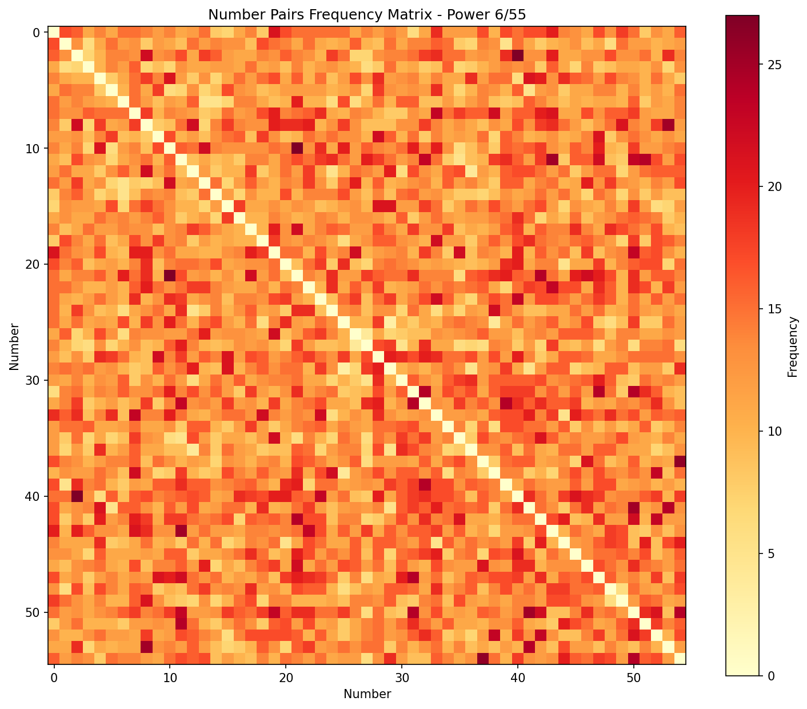

# 🎰 Vietlott Data

[](https://github.com/haah82/vietlott-data-update/actions)
[](https://www.python.org/downloads/)
[](LICENSE)
[](https://github.com/haah82/vietlott-data-update/commits/main)
[](https://haah82.github.io/vietlott-data-update/)

> 📊 **Thu thập và Tổng hợp Dữ liệu Vietlott Tự động nhằm mục đích học tập và giải trí**
>
> Dự án tự động thu thập và phân tích dữ liệu kết quả xổ số từ [vietlott.vn](https://vietlott.vn/), cung cấp thống kê chi tiết cho tất cả các sản phẩm.

## 🎯 Supported Lottery Products

| Product | Link | Description |
|---------|------|-------------|
| **Power 6/55** | [🔗 Results](https://vietlott.vn/vi/trung-thuong/ket-qua-trung-thuong/655.html) | Choose 6 numbers from 1-55 |
| **Power 6/45** | [🔗 Results](https://vietlott.vn/vi/trung-thuong/ket-qua-trung-thuong/645.html) | Choose 6 numbers from 1-45 |
| **Power 5/35** | [🔗 Results](https://vietlott.vn/vi/trung-thuong/ket-qua-trung-thuong/535.html) | Choose 5 numbers from 1-35 |
| **Keno** | [🔗 Results](https://vietlott.vn/vi/trung-thuong/ket-qua-trung-thuong/winning-number-keno.html) | Fast-pace number game |
| **Max 3D** | [🔗 Results](https://vietlott.vn/vi/trung-thuong/ket-qua-trung-thuong/max-3d.html) | 3-digit lottery game |
| **Max 3D Pro** | [🔗 Results](https://vietlott.vn/vi/trung-thuong/ket-qua-trung-thuong/max-3dpro.html) | Enhanced 3D lottery |
| **Bingo18** | [🔗 Results](https://vietlott.vn/vi/trung-thuong/ket-qua-trung-thuong/winning-number-bingo18.html) | 3 numbers from 0-9 game |


## 📋 Table of Contents

- [🎯 Supported Lottery Products](#-supported-lottery-products)
- [📊 Data Statistics](#-data-statistics)
- [🏆 Top Probability Summary](#-top-probability-summary)
- [📈 Top Backtest Summary](#-top-backtest-summary-machine-learning)
- [Predictions](#-predictions)
- [📈 Power 6/55 Analysis](#-power-655-analysis)
  - [📅 Recent Results](#-recent-results)
  - [🎲 Number Frequency (All Time)](#-number-frequency-all-time)
  - [📊 Frequency Analysis by Period](#-frequency-analysis-by-period)
- [📈 Power 6/45 Analysis](#-power-645-analysis)
  - [📅 Recent Results 6/45](#-recent-results-last-10-draws-645)
  - [🎲 Number Frequency 6/45](#-number-frequency-all-time-645)
- [📈 Max 3D Analysis](#-max-3d-analysis)
- [📈 Max 3D Pro Analysis](#-max-3d-pro-analysis)
- [⚙️ How It Works](#️-how-it-works)
- [🚀 Installation & Usage](#-installation--usage)
- [📄 License](#-license)


## 📊 Data Statistics

| Product | Total Draws | Start Date | End Date | Total Records | First ID | Latest ID |
| --- | --- | --- | --- | --- | --- | --- |
| Power 655 | 1300 | 2017-08-01 | 2026-01-27 | 1300 | 00001 | 01300 |
| Power 645 | 1267 | 2017-10-25 | 2026-01-28 | 1267 | 00198 | 01464 |
| Power 535 | 179 | 2025-06-29 | 2026-01-27 | 357 | 00001 | 00426 |
| Keno | 412 | 2022-12-04 | 2026-01-28 | 52911 | #0110271 | #0268413 |
| 3D | 1031 | 2019-04-22 | 2026-01-28 | 1031 | 00001 | 01035 |
| 3D Pro | 677 | 2021-09-14 | 2026-01-27 | 677 | 00001 | 00681 |
| Bingo18 | 387 | 2024-12-03 | 2026-01-28 | 52872 | 0083123 | 0150019 |


### 📊 Visualized Analysis




## 🏆 Top Probability Summary

This table shows the top 10 most frequent results (highest weights) for each major product.

| Rank | Product | Number/Set | Probability (%) |
| --- | --- | --- | --- |
| 1 | Power 6/55 | 41 | 2.12 |
| 2 | Power 6/55 | 22 | 2.08 |
| 3 | Power 6/55 | 43 | 2.06 |
| 4 | Power 6/55 | 34 | 2.04 |
| 5 | Power 6/55 | 51 | 2.03 |
| 6 | Power 6/55 | 9 | 1.99 |
| 7 | Power 6/55 | 40 | 1.99 |
| 8 | Power 6/55 | 20 | 1.97 |
| 9 | Power 6/55 | 48 | 1.96 |
| 10 | Power 6/55 | 23 | 1.95 |
| 1 | Power 6/45 | 10 | 2.5 |
| 2 | Power 6/45 | 24 | 2.49 |
| 3 | Power 6/45 | 19 | 2.49 |
| 4 | Power 6/45 | 7 | 2.43 |
| 5 | Power 6/45 | 22 | 2.42 |
| 6 | Power 6/45 | 28 | 2.42 |
| 7 | Power 6/45 | 37 | 2.41 |
| 8 | Power 6/45 | 44 | 2.38 |
| 9 | Power 6/45 | 20 | 2.35 |
| 10 | Power 6/45 | 30 | 2.34 |
| 1 | Max 3D Plus | 380 | 0.17 |
| 2 | Max 3D Plus | 656 | 0.17 |
| 3 | Max 3D Plus | 734 | 0.17 |
| 4 | Max 3D Plus | 706 | 0.16 |
| 5 | Max 3D Plus | 094 | 0.16 |
| 6 | Max 3D Plus | 056 | 0.16 |
| 7 | Max 3D Plus | 799 | 0.16 |
| 8 | Max 3D Plus | 720 | 0.16 |
| 9 | Max 3D Plus | 350 | 0.16 |
| 10 | Max 3D Plus | 939 | 0.16 |
| 1 | Max 3D Pro | 769 | 0.18 |
| 2 | Max 3D Pro | 746 | 0.18 |
| 3 | Max 3D Pro | 159 | 0.18 |
| 4 | Max 3D Pro | 605 | 0.18 |
| 5 | Max 3D Pro | 089 | 0.17 |
| 6 | Max 3D Pro | 190 | 0.17 |
| 7 | Max 3D Pro | 008 | 0.16 |
| 8 | Max 3D Pro | 542 | 0.16 |
| 9 | Max 3D Pro | 074 | 0.16 |
| 10 | Max 3D Pro | 217 | 0.16 |


## 📈 Top Backtest Summary (Machine Learning)

This table shows the top 10 numbers most frequently predicted by our ML models (Frequency & Pattern) during recent backtests.

| Rank | Product | Number/Set | Probability (%) |
| --- | --- | --- | --- |
| 1 | Power 6/55 | 10 | 2.56 |
| 2 | Power 6/55 | 34 | 2.5 |
| 3 | Power 6/55 | 4 | 2.44 |
| 4 | Power 6/55 | 19 | 2.39 |
| 5 | Power 6/55 | 16 | 2.33 |
| 6 | Power 6/55 | 23 | 2.33 |
| 7 | Power 6/55 | 14 | 2.28 |
| 8 | Power 6/55 | 20 | 2.17 |
| 9 | Power 6/55 | 33 | 2.17 |
| 10 | Power 6/55 | 12 | 2.17 |
| 1 | Power 6/45 | 5 | 3.5 |
| 2 | Power 6/45 | 9 | 2.89 |
| 3 | Power 6/45 | 18 | 2.83 |
| 4 | Power 6/45 | 8 | 2.78 |
| 5 | Power 6/45 | 7 | 2.72 |
| 6 | Power 6/45 | 23 | 2.72 |
| 7 | Power 6/45 | 13 | 2.72 |
| 8 | Power 6/45 | 19 | 2.67 |
| 9 | Power 6/45 | 15 | 2.67 |
| 10 | Power 6/45 | 2 | 2.61 |
| 1 | Max 3D Plus | 952 | 0.56 |
| 2 | Max 3D Plus | 727 | 0.56 |
| 3 | Max 3D Plus | 786 | 0.44 |
| 4 | Max 3D Plus | 532 | 0.44 |
| 5 | Max 3D Plus | 230 | 0.44 |
| 6 | Max 3D Plus | 281 | 0.44 |
| 7 | Max 3D Plus | 852 | 0.44 |
| 8 | Max 3D Plus | 277 | 0.44 |
| 9 | Max 3D Plus | 772 | 0.44 |
| 10 | Max 3D Plus | 262 | 0.44 |
| 1 | Max 3D Pro | 940 | 0.56 |
| 2 | Max 3D Pro | 562 | 0.56 |
| 3 | Max 3D Pro | 081 | 0.44 |
| 4 | Max 3D Pro | 007 | 0.44 |
| 5 | Max 3D Pro | 018 | 0.44 |
| 6 | Max 3D Pro | 390 | 0.44 |
| 7 | Max 3D Pro | 089 | 0.44 |
| 8 | Max 3D Pro | 492 | 0.44 |
| 9 | Max 3D Pro | 678 | 0.44 |
| 10 | Max 3D Pro | 847 | 0.44 |


## Predictions

Models and predictions are updated daily at [/src/predictions](./src/machine_learning/prediction_summary.md)

## 📈 Power 6/55 Analysis

### 📅 Recent Results (Last 10 draws)
| date | id | result | process_time |
| --- | --- | --- | --- |
| 2026-01-27 | 01300 | [13, 22, 32, 42, 53, 54, 29] | 2026-01-28T11:58:04.542770 |
| 2026-01-24 | 01299 | [14, 24, 25, 30, 35, 53, 18] | 2026-01-28T11:58:04.543027 |
| 2026-01-22 | 01298 | [2, 20, 21, 29, 36, 50, 5] | 2026-01-28T11:58:04.543187 |
| 2026-01-20 | 01297 | [4, 20, 26, 28, 37, 41, 32] | 2026-01-28T11:58:04.543310 |
| 2026-01-17 | 01296 | [14, 21, 23, 25, 46, 48, 54] | 2026-01-28T11:58:04.543465 |
| 2026-01-15 | 01295 | [13, 21, 31, 34, 48, 55, 27] | 2026-01-28T11:58:04.543583 |
| 2026-01-13 | 01294 | [3, 12, 25, 51, 52, 55, 43] | 2026-01-28T11:58:04.543702 |
| 2026-01-10 | 01293 | [9, 16, 30, 33, 34, 38, 49] | 2026-01-28T11:58:04.543954 |
| 2026-01-08 | 01292 | [20, 22, 36, 43, 45, 50, 47] | 2026-01-09T18:53:58.591551 |
| 2026-01-06 | 01291 | [22, 28, 29, 30, 34, 47, 20] | 2026-01-09T18:53:58.591650 |

### 🎲 Number Frequency (All Time)
| result | count | % | -1 | 1result | 1count | 1% | -2 | 2result | 2count | 2% |
| --- | --- | --- | --- | --- | --- | --- | --- | --- | --- | --- |
| 41 | 193 | 2.12 |  | 44 | 170 | 1.87 |  | 54 | 156 | 1.71 |
| 22 | 189 | 2.08 |  | 52 | 169 | 1.86 |  | 39 | 156 | 1.71 |
| 43 | 187 | 2.06 |  | 46 | 169 | 1.86 |  | 10 | 156 | 1.71 |
| 34 | 186 | 2.04 |  | 24 | 168 | 1.85 |  | 27 | 153 | 1.68 |
| 51 | 185 | 2.03 |  | 33 | 168 | 1.85 |  | 15 | 153 | 1.68 |
| 9 | 181 | 1.99 |  | 18 | 167 | 1.84 |  | 30 | 151 | 1.66 |
| 40 | 181 | 1.99 |  | 5 | 167 | 1.84 |  | 37 | 151 | 1.66 |
| 20 | 179 | 1.97 |  | 14 | 167 | 1.84 |  | 26 | 151 | 1.66 |
| 48 | 178 | 1.96 |  | 19 | 166 | 1.82 |  | 2 | 150 | 1.65 |
| 23 | 177 | 1.95 |  | 45 | 165 | 1.81 |  | 17 | 149 | 1.64 |
| 8 | 177 | 1.95 |  | 49 | 165 | 1.81 |  | 25 | 147 | 1.62 |
| 29 | 177 | 1.95 |  | 55 | 165 | 1.81 |  | 28 | 145 | 1.59 |
| 3 | 176 | 1.93 |  | 47 | 165 | 1.81 |  | 7 | 141 | 1.55 |
| 31 | 174 | 1.91 |  | 50 | 165 | 1.81 |  | 6 | 139 | 1.53 |
| 12 | 173 | 1.9 |  | 35 | 163 | 1.79 |  | 4 | 137 | 1.51 |
| 1 | 173 | 1.9 |  | 21 | 161 | 1.77 |  |  |  |  |
| 53 | 172 | 1.89 |  | 38 | 160 | 1.76 |  |  |  |  |
| 42 | 171 | 1.88 |  | 13 | 159 | 1.75 |  |  |  |  |
| 32 | 171 | 1.88 |  | 16 | 158 | 1.74 |  |  |  |  |
| 11 | 170 | 1.87 |  | 36 | 157 | 1.73 |  |  |  |  |

### 📊 Frequency Analysis by Period

#### Last 30 Days
No data available

#### Last 60 Days
No data available

#### Last 90 Days
No data available


## 📈 Power 6/45 Analysis

### 📅 Recent Results (Last 10 draws)
| date | id | result | process_time |
| --- | --- | --- | --- |
| 2026-01-28 | 01464 | [4, 10, 16, 19, 27, 40] | 2026-01-29T10:50:00.000000 |
| 2026-01-25 | 01463 | [2, 19, 20, 24, 33, 34] | 2026-01-28T11:58:05.928761 |
| 2026-01-23 | 01462 | [9, 15, 16, 20, 22, 31] | 2026-01-28T11:58:05.928894 |
| 2026-01-21 | 01461 | [1, 18, 23, 24, 29, 37] | 2026-01-28T11:58:05.928996 |
| 2026-01-18 | 01460 | [2, 5, 15, 26, 39, 42] | 2026-01-28T11:58:05.929135 |
| 2026-01-16 | 01459 | [2, 10, 21, 31, 34, 40] | 2026-01-28T11:58:05.929236 |
| 2026-01-14 | 01458 | [1, 22, 23, 28, 39, 45] | 2026-01-28T11:58:05.929332 |
| 2026-01-11 | 01457 | [8, 10, 21, 25, 31, 38] | 2026-01-28T11:58:05.929428 |
| 2026-01-09 | 01456 | [8, 9, 17, 21, 36, 45] | 2026-01-09T18:55:03.608163 |
| 2026-01-07 | 01455 | [1, 5, 7, 28, 31, 43] | 2026-01-09T18:55:03.608263 |

### 🎲 Number Frequency (All Time)
| result | count | % | -1 | 1result | 1count | 1% | -2 | 2result | 2count | 2% |
| --- | --- | --- | --- | --- | --- | --- | --- | --- | --- | --- |
| 10 | 190 | 2.5 |  | 5 | 170 | 2.24 |  | 3 | 155 | 2.04 |
| 24 | 189 | 2.49 |  | 35 | 170 | 2.24 |  | 12 | 152 | 2.0 |
| 19 | 189 | 2.49 |  | 26 | 169 | 2.22 |  | 32 | 152 | 2.0 |
| 7 | 185 | 2.43 |  | 23 | 169 | 2.22 |  | 38 | 147 | 1.93 |
| 22 | 184 | 2.42 |  | 25 | 168 | 2.21 |  | 17 | 145 | 1.91 |
| 28 | 184 | 2.42 |  | 13 | 168 | 2.21 |  |  |  |  |
| 37 | 183 | 2.41 |  | 43 | 167 | 2.2 |  |  |  |  |
| 44 | 181 | 2.38 |  | 16 | 167 | 2.2 |  |  |  |  |
| 20 | 179 | 2.35 |  | 8 | 166 | 2.18 |  |  |  |  |
| 30 | 178 | 2.34 |  | 33 | 165 | 2.17 |  |  |  |  |
| 4 | 177 | 2.33 |  | 6 | 165 | 2.17 |  |  |  |  |
| 34 | 176 | 2.32 |  | 42 | 165 | 2.17 |  |  |  |  |
| 29 | 175 | 2.3 |  | 14 | 163 | 2.14 |  |  |  |  |
| 41 | 175 | 2.3 |  | 39 | 160 | 2.1 |  |  |  |  |
| 27 | 174 | 2.29 |  | 9 | 160 | 2.1 |  |  |  |  |
| 18 | 172 | 2.26 |  | 40 | 159 | 2.09 |  |  |  |  |
| 11 | 172 | 2.26 |  | 36 | 157 | 2.07 |  |  |  |  |
| 31 | 171 | 2.25 |  | 2 | 157 | 2.07 |  |  |  |  |
| 45 | 170 | 2.24 |  | 21 | 156 | 2.05 |  |  |  |  |
| 1 | 170 | 2.24 |  | 15 | 156 | 2.05 |  |  |  |  |

### 📊 Frequency Analysis by Period

#### Last 30 Days
No data available

#### Last 60 Days
No data available

#### Last 90 Days
No data available


## 📈 Max 3D Plus Analysis

### 📅 Recent Results (Last 10 draws)
| date | id | result |
| --- | --- | --- |
| 2026-01-28 | 01035 | 230, 078, 458, 495, 512, 327, 284, 845, 180, 514, 740, 856, 447, 526, 027, 534, 659, 949, 069, 787 |
| 2026-01-26 | 01034 | 387, 105, 761, 101, 691, 797, 228, 757, 159, 887, 317, 665, 523, 953, 890, 667, 784, 618, 057, 482 |
| 2026-01-23 | 01033 | 636, 706, 634, 492, 253, 671, 403, 386, 914, 136, 747, 146, 132, 149, 185, 124, 839, 239, 586, 770 |
| 2026-01-21 | 01032 | 329, 543, 596, 787, 891, 800, 819, 213, 206, 550, 621, 253, 944, 613, 750, 052, 138, 233, 549, 670 |
| 2026-01-19 | 01031 | 970, 565, 027, 874, 783, 830, 274, 003, 397, 905, 241, 094, 298, 317, 857, 824, 003, 435, 490, 967 |
| 2026-01-16 | 01030 | 281, 783, 483, 390, 737, 094, 456, 913, 375, 285, 095, 574, 262, 087, 011, 221, 016, 416, 033, 134 |
| 2026-01-14 | 01029 | 564, 868, 479, 129, 469, 619, 222, 819, 746, 155, 552, 986, 236, 186, 054, 452, 386, 667, 168, 385 |
| 2026-01-12 | 01028 | 215, 039, 339, 588, 268, 942, 714, 714, 277, 155, 660, 394, 757, 987, 734, 288, 350, 885, 108, 770 |
| 2026-01-09 | 01027 | 852, 190, 250, 008, 296, 153, 674, 284, 340, 893, 296, 152, 611, 783, 349, 765, 362, 106, 913, 540 |
| 2026-01-07 | 01026 | 454, 459, 691, 416, 897, 741, 868, 965, 785, 869, 872, 207, 269, 945, 606, 403, 071, 958, 476, 171 |

### 🎲 Top 3-Digit Number Frequency (All Time)
| result | count | % | -1 | 1result | 1count | 1% | -2 | 2result | 2count | 2% | -3 | 3result | 3count | 3% | -4 | 4result | 4count | 4% |
| --- | --- | --- | --- | --- | --- | --- | --- | --- | --- | --- | --- | --- | --- | --- | --- | --- | --- | --- |
| 380 | 36 | 0.17 |  | 691 | 30 | 0.15 |  | 881 | 28 | 0.14 |  | 646 | 28 | 0.14 |  | 046 | 27 | 0.13 |
| 734 | 35 | 0.17 |  | 750 | 30 | 0.15 |  | 189 | 28 | 0.14 |  | 895 | 28 | 0.14 |  | 843 | 27 | 0.13 |
| 656 | 35 | 0.17 |  | 450 | 30 | 0.15 |  | 846 | 28 | 0.14 |  | 425 | 28 | 0.14 |  | 115 | 27 | 0.13 |
| 706 | 34 | 0.16 |  | 190 | 30 | 0.15 |  | 834 | 28 | 0.14 |  | 661 | 28 | 0.14 |  | 933 | 27 | 0.13 |
| 094 | 34 | 0.16 |  | 411 | 30 | 0.15 |  | 037 | 28 | 0.14 |  | 589 | 28 | 0.14 |  | 607 | 27 | 0.13 |
| 799 | 32 | 0.16 |  | 099 | 30 | 0.15 |  | 546 | 28 | 0.14 |  | 625 | 28 | 0.14 |  | 359 | 27 | 0.13 |
| 056 | 32 | 0.16 |  | 222 | 29 | 0.14 |  | 255 | 28 | 0.14 |  | 048 | 28 | 0.14 |  | 719 | 27 | 0.13 |
| 350 | 32 | 0.16 |  | 284 | 29 | 0.14 |  | 866 | 28 | 0.14 |  | 800 | 27 | 0.13 |  | 372 | 27 | 0.13 |
| 720 | 32 | 0.16 |  | 163 | 29 | 0.14 |  | 400 | 28 | 0.14 |  | 240 | 27 | 0.13 |  | 441 | 27 | 0.13 |
| 939 | 32 | 0.16 |  | 329 | 29 | 0.14 |  | 215 | 28 | 0.14 |  | 865 | 27 | 0.13 |  | 223 | 27 | 0.13 |
| 217 | 31 | 0.15 |  | 331 | 29 | 0.14 |  | 321 | 28 | 0.14 |  | 058 | 27 | 0.13 |  | 721 | 27 | 0.13 |
| 052 | 31 | 0.15 |  | 489 | 29 | 0.14 |  | 970 | 28 | 0.14 |  | 043 | 27 | 0.13 |  | 239 | 27 | 0.13 |
| 006 | 31 | 0.15 |  | 878 | 29 | 0.14 |  | 525 | 28 | 0.14 |  | 486 | 27 | 0.13 |  | 805 | 27 | 0.13 |
| 459 | 31 | 0.15 |  | 021 | 28 | 0.14 |  | 766 | 28 | 0.14 |  | 176 | 27 | 0.13 |  | 466 | 27 | 0.13 |
| 769 | 31 | 0.15 |  | 528 | 28 | 0.14 |  | 086 | 28 | 0.14 |  | 033 | 27 | 0.13 |  | 510 | 27 | 0.13 |
| 289 | 31 | 0.15 |  | 855 | 28 | 0.14 |  | 085 | 28 | 0.14 |  | 543 | 27 | 0.13 |  | 016 | 27 | 0.13 |
| 786 | 31 | 0.15 |  | 550 | 28 | 0.14 |  | 226 | 28 | 0.14 |  | 449 | 27 | 0.13 |  | 914 | 27 | 0.13 |
| 334 | 31 | 0.15 |  | 250 | 28 | 0.14 |  | 156 | 28 | 0.14 |  | 458 | 27 | 0.13 |  | 463 | 27 | 0.13 |
| 553 | 30 | 0.15 |  | 960 | 28 | 0.14 |  | 790 | 28 | 0.14 |  | 437 | 27 | 0.13 |  | 694 | 27 | 0.13 |
| 470 | 30 | 0.15 |  | 377 | 28 | 0.14 |  | 005 | 28 | 0.14 |  | 780 | 27 | 0.13 |  | 966 | 27 | 0.13 |


## 📈 Max 3D Pro Analysis

### 📅 Recent Results (Last 10 draws)
| date | id | result |
| --- | --- | --- |
| 2026-01-27 | 00681 | 476, 095, 381, 140, 583, 403, 142, 016, 246, 072, 223, 370, 057, 217, 454, 146, 315, 187, 037, 826 |
| 2026-01-24 | 00680 | 746, 888, 209, 104, 313, 142, 440, 551, 347, 726, 220, 289, 699, 033, 191, 564, 233, 005, 643, 751 |
| 2026-01-22 | 00679 | 973, 168, 533, 763, 839, 577, 339, 010, 755, 382, 502, 413, 868, 060, 011, 385, 174, 275, 865, 302 |
| 2026-01-20 | 00678 | 488, 601, 740, 289, 503, 913, 273, 426, 194, 253, 040, 725, 369, 327, 671, 081, 084, 828, 523, 704 |
| 2026-01-17 | 00677 | 235, 479, 761, 467, 138, 079, 762, 734, 446, 404, 234, 192, 300, 897, 032, 279, 115, 871, 981, 769 |
| 2026-01-15 | 00676 | 388, 370, 052, 992, 685, 586, 045, 570, 855, 618, 181, 236, 500, 021, 667, 849, 813, 382, 775, 846 |
| 2026-01-13 | 00675 | 269, 976, 212, 045, 166, 886, 175, 251, 054, 167, 511, 656, 550, 617, 031, 990, 417, 434, 216, 314 |
| 2026-01-10 | 00674 | 700, 992, 979, 945, 716, 026, 833, 938, 133, 237, 377, 863, 674, 795, 548, 117, 506, 517, 562, 835 |
| 2026-01-08 | 00673 | 770, 703, 262, 546, 240, 781, 638, 115, 515, 173, 468, 449, 401, 776, 689, 713, 405, 245, 370, 111 |
| 2026-01-06 | 00672 | 059, 919, 866, 314, 088, 357, 807, 268, 201, 344, 006, 217, 924, 282, 356, 166, 711, 479, 936, 458 |

### 🎲 Top 3-Digit Number Frequency (All Time)
| result | count | % | -1 | 1result | 1count | 1% | -2 | 2result | 2count | 2% | -3 | 3result | 3count | 3% | -4 | 4result | 4count | 4% |
| --- | --- | --- | --- | --- | --- | --- | --- | --- | --- | --- | --- | --- | --- | --- | --- | --- | --- | --- |
| 769 | 25 | 0.18 |  | 480 | 21 | 0.16 |  | 107 | 20 | 0.15 |  | 719 | 19 | 0.14 |  | 689 | 19 | 0.14 |
| 159 | 24 | 0.18 |  | 065 | 21 | 0.16 |  | 666 | 20 | 0.15 |  | 701 | 19 | 0.14 |  | 985 | 19 | 0.14 |
| 746 | 24 | 0.18 |  | 262 | 21 | 0.16 |  | 416 | 20 | 0.15 |  | 598 | 19 | 0.14 |  | 591 | 19 | 0.14 |
| 605 | 24 | 0.18 |  | 624 | 21 | 0.16 |  | 790 | 20 | 0.15 |  | 881 | 19 | 0.14 |  | 024 | 19 | 0.14 |
| 089 | 23 | 0.17 |  | 966 | 21 | 0.16 |  | 674 | 20 | 0.15 |  | 726 | 19 | 0.14 |  | 422 | 19 | 0.14 |
| 190 | 23 | 0.17 |  | 555 | 21 | 0.16 |  | 829 | 20 | 0.15 |  | 637 | 19 | 0.14 |  | 608 | 19 | 0.14 |
| 809 | 22 | 0.16 |  | 792 | 21 | 0.16 |  | 199 | 20 | 0.15 |  | 992 | 19 | 0.14 |  | 212 | 19 | 0.14 |
| 896 | 22 | 0.16 |  | 728 | 21 | 0.16 |  | 134 | 20 | 0.15 |  | 026 | 19 | 0.14 |  | 363 | 19 | 0.14 |
| 008 | 22 | 0.16 |  | 536 | 21 | 0.16 |  | 297 | 20 | 0.15 |  | 346 | 19 | 0.14 |  | 554 | 19 | 0.14 |
| 217 | 22 | 0.16 |  | 547 | 21 | 0.16 |  | 834 | 20 | 0.15 |  | 052 | 19 | 0.14 |  | 696 | 19 | 0.14 |
| 542 | 22 | 0.16 |  | 207 | 21 | 0.16 |  | 332 | 20 | 0.15 |  | 476 | 19 | 0.14 |  | 550 | 19 | 0.14 |
| 074 | 22 | 0.16 |  | 351 | 21 | 0.16 |  | 533 | 20 | 0.15 |  | 086 | 19 | 0.14 |  | 856 | 19 | 0.14 |
| 523 | 21 | 0.16 |  | 766 | 20 | 0.15 |  | 327 | 20 | 0.15 |  | 367 | 19 | 0.14 |  | 097 | 19 | 0.14 |
| 341 | 21 | 0.16 |  | 116 | 20 | 0.15 |  | 722 | 20 | 0.15 |  | 306 | 19 | 0.14 |  | 220 | 19 | 0.14 |
| 420 | 21 | 0.16 |  | 654 | 20 | 0.15 |  | 195 | 20 | 0.15 |  | 636 | 19 | 0.14 |  | 716 | 19 | 0.14 |
| 087 | 21 | 0.16 |  | 500 | 20 | 0.15 |  | 296 | 20 | 0.15 |  | 619 | 19 | 0.14 |  | 249 | 19 | 0.14 |
| 623 | 21 | 0.16 |  | 661 | 20 | 0.15 |  | 634 | 20 | 0.15 |  | 802 | 19 | 0.14 |  | 544 | 19 | 0.14 |
| 218 | 21 | 0.16 |  | 216 | 20 | 0.15 |  | 553 | 20 | 0.15 |  | 987 | 19 | 0.14 |  | 456 | 19 | 0.14 |
| 392 | 21 | 0.16 |  | 543 | 20 | 0.15 |  | 143 | 20 | 0.15 |  | 702 | 19 | 0.14 |  | 164 | 19 | 0.14 |
| 280 | 21 | 0.16 |  | 235 | 20 | 0.15 |  | 246 | 19 | 0.14 |  | 568 | 19 | 0.14 |  | 221 | 19 | 0.14 |


## ⚙️ How It Works

### 🤖 Automated Data Collection

This project runs completely automatically using **GitHub Actions** - no server required!

- **⏰ Schedule**: Runs daily via [GitHub Actions workflow](.github/workflows/crawl.yaml)
- **🔄 Process**: Fetches latest results → Processes data → Commits to repository
- **📊 Analysis**: Generates statistics and updates README automatically

### 🕵️ Data Crawling Method

The data collection works by:
1. **🔍 Network Analysis**: Inspecting browser-server communication
2. **🐍 Python Replication**: Recreating the data fetch logic in Python
3. **📋 Structured Storage**: Saving results in JSONL format for easy analysis
4. **🔄 Continuous Updates**: Daily automated runs ensure fresh data

> **Note**: This is purely for educational and research purposes. No gambling advice is provided.


## 🚀 Installation & Usage

### 📦 Install via pip

```bash
pip install -i vietlott-data
```

### 💻 Command Line Interface

#### 🔍 Crawl Data

```bash
vietlott-crawl [OPTIONS] PRODUCT

# Options:
#   --run-date TEXT       Specific date to crawl (default: current date)
#   --index-from INTEGER  Starting page index (default: 0)
#   --index-to INTEGER    Ending page index (default: None)
#   --help               Show help message
```

#### 🔧 Backfill Missing Data

```bash
vietlott-missing [OPTIONS] PRODUCT

# Options:
#   --limit INTEGER  Number of pages to process (default: 20)
#   --help          Show help message
```

> **Available Products**: power_655, power_645, power_535, keno, 3d, 3d_pro, bingo18

### 🛠️ Development Setup

```bash
# Clone the repository
git clone https://github.com/haah82/vietlott-data-update.git ; cd vietlott-data-update

# Install dependencies (recommend using uv and virtual environment)
uv sync --dev

# Run tests
uv run pytest
```

## 📄 License

This project is licensed under the MIT License - see the [LICENSE](LICENSE) file for details.

---

<div align="center">
  <strong>⭐ If you find this project useful, please consider giving it a star!</strong>
</div>

